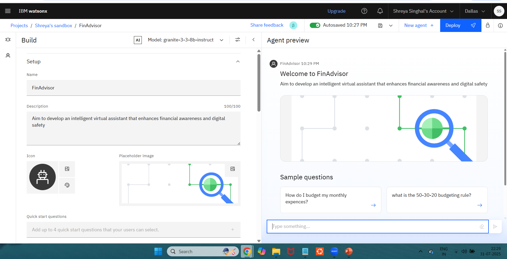
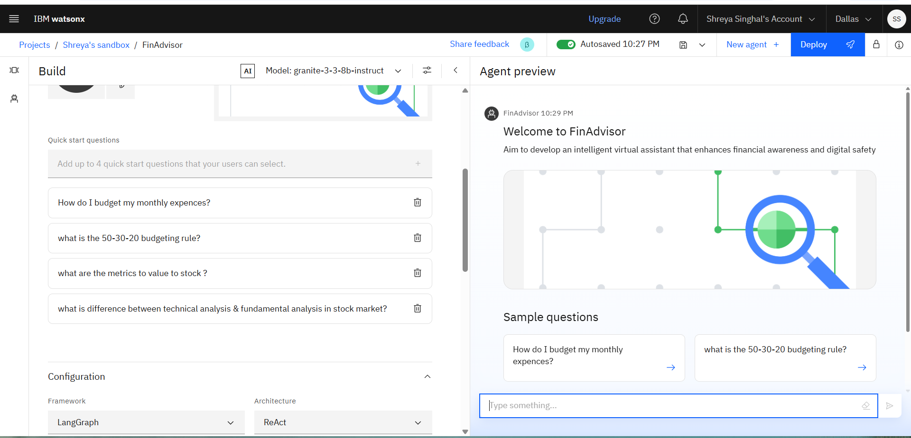
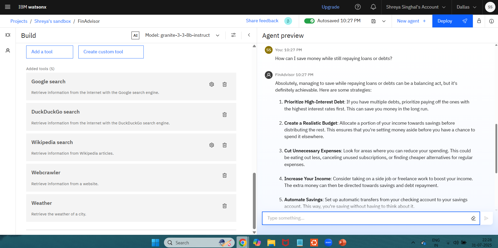
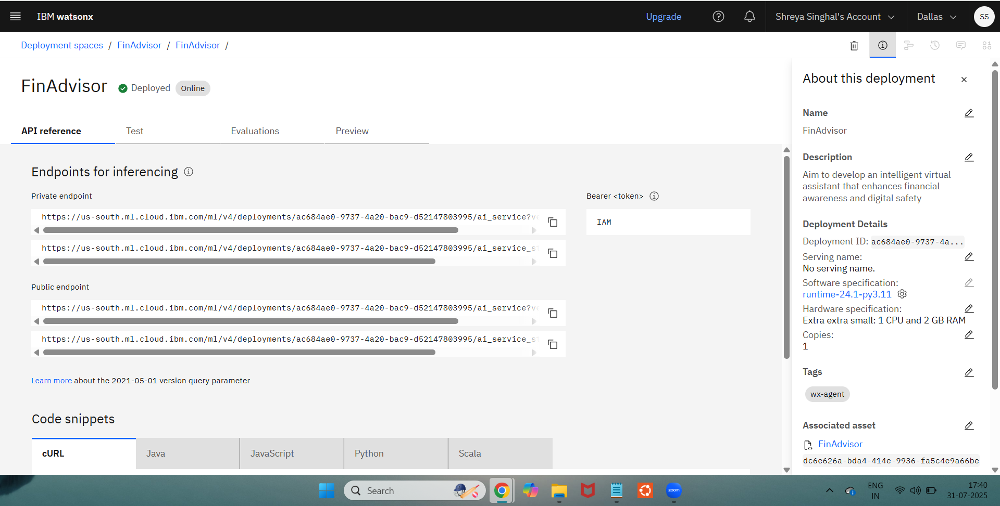

# IBM-cloud-Finance-Advisor-AI-agent

# 📝Overview
Digital Financial Literacy Agent,
It aims to assist users in understanding essential financial tools and concepts like UPI, interest rates, budgeting, and online scam prevention, using AI + RAG (Retrieval-Augmented Generation).The agent supports multilingual queries, enabling users from diverse backgrounds to ask questions in their native language. It retrieves factual, updated information from reliable sources like RBI, NPCI, and government portals, making financial knowledge accessible to all.

# 🚀Features
- Multilingual support (Hindi, English, etc.)
- Real-time retrieval of trustworthy content using RAG
- Explains UPI, banking terms, interest rates, budgeting
- Detects and educates about online frauds and scams
- Personalized answers based on user intent
- Simple and user-friendly interface

 # 📌Usage

Users can:
- Ask financial questions in their own language  
- Get responses sourced from verified financial websites  
- Learn safe practices for digital banking and payments  
- Use the agent as a learning tool for digital finance

 #  🖼️Screenshots
 ### Set up 
 

 ### Quick Start Questions
 

 ### Tools used & testing
 

 ### Reference and deployment
 

# 💬Example Prompts

- “How do I send money via UPI?”
- “Is it safe to share my UPI PIN?”
- “What is a good interest rate for a personal loan?”
- “How can I make a monthly budget?”
- “Kaise pata chalega ki financial website fake hai?”

# ☁️IBM Cloud Services Used

- IBM Granite – for large language model responses  
- IBM Cloud Lite – for serverless deployment  
- IBM Watson Assistant (optional) – for user intent handling  
- IBM Knowledge Studio / RAG setup – to retrieve data from documents and portals

# ⚙️How It Works

1. User asks a question (e.g., in Hindi or English)  
2. Input is passed through the AI Agent (backed by IBM Granite)  
3. Agent uses *RAG* to retrieve relevant data from:
   - Government financial portals  
   - RBI/NPCI websites  
   - Educational platforms  
4. Response is personalized, translated (if needed), and shown to the user in simple terms

# ✅Do’s

- Ask clear finance-related questions  
- Explore in your local language  
- Use it as a learning assistant  
- Verify advice before applying in real-world banking

# ❌Don’ts

- Don’t share personal bank credentials  
- Don’t rely on it for investment or legal decisions  
- Don’t misuse the assistant for unrelated queries  
- Don’t use it as a replacement for official bank guidance

# ✅ Conclusion

This project showcases how AI and IBM Cloud can simplify financial concepts for everyday users. By providing real-time, multilingual support using reliable data, the agent promotes safe digital financial practices and empowers users with financial confidence.

 ✨ This AI Agent is an educational prototype designed to promote safe and inclusive financial literacy.

